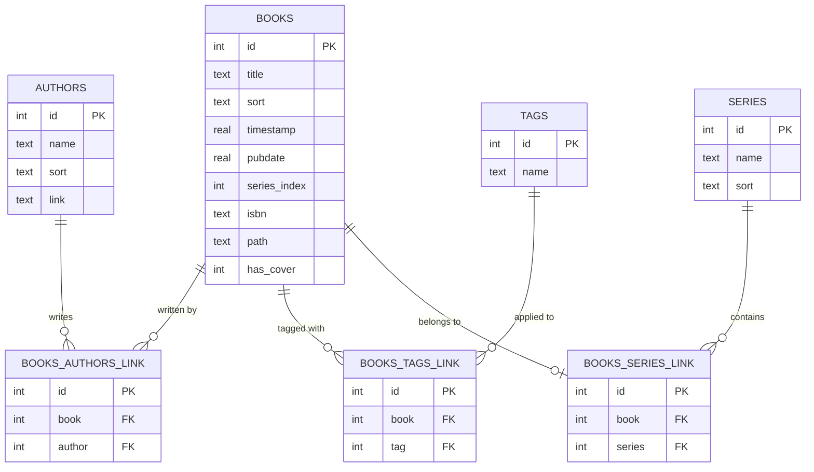
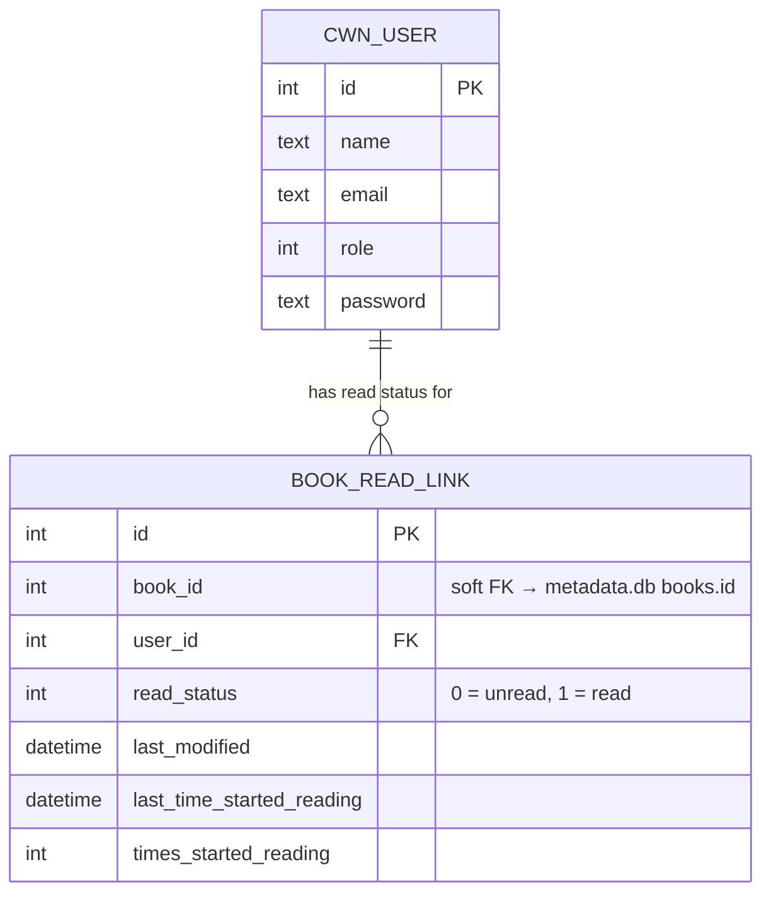
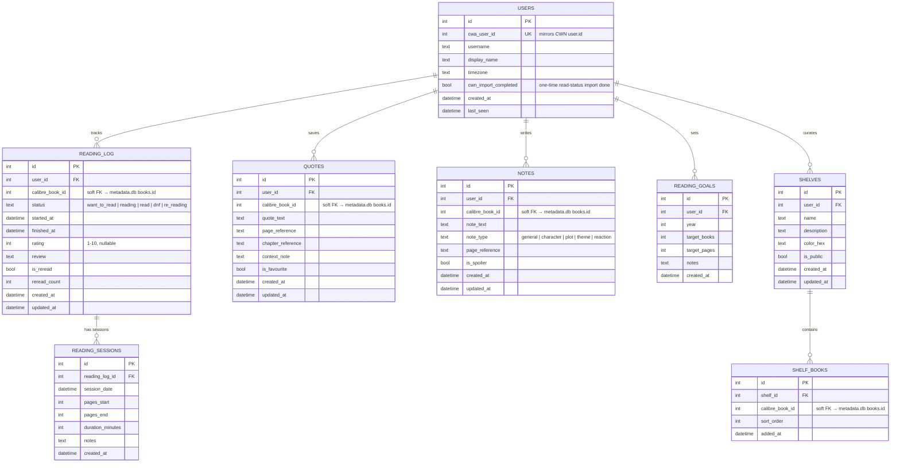

# Calibre Reading Tracker — Data Model

```table-of-contents
```

## Overview

The tracker works with **three SQLite databases**:

- `metadata.db` — Calibre's existing database. Treated as **read-only**. Never written to.
- `app.db` — Calibre Web NextGen's database. Treated as **read-only**. Used for auth (user/session lookup) and one-time read-status import.
- `tracker.db` — The companion app's own database. All reading tracker data lives here.

`metadata.db` and `tracker.db` share a relationship via `calibre_book_id`, which maps to `books.id` in `metadata.db`. At the application layer (SQLAlchemy), cross-DB reads are handled by attaching `metadata.db` to the same connection, or simply by querying them through separate engines and joining in Python.

## Calibre DB — Relevant Tables (Read-Only)

These are the Calibre tables your app will read from. You do **not** define these — they already exist.



> **Cover images** are stored on disk at `{library_root}/{path}/cover.jpg`, where `path` comes from `books.path`. Mount this volume into your tracker container.

## CWN DB — Relevant Tables (Read-Only)

These tables live in CWN's `app.db`. The tracker reads from them but **never writes**. The connection uses SQLite URI `mode=ro`.



### `book_read_link`

CWN's per-user read/unread flag for every book a user has interacted with. Used **once** at tracker onboarding to seed `reading_log` with books the user has already marked as read in CWN. After that initial import the tracker owns status — `book_read_link` is not consulted again during normal operation.

| Column | Notes |
|---|---|
| `book_id` | Maps to `books.id` in `metadata.db` — the same key used as `calibre_book_id` throughout the tracker. |
| `user_id` | Maps to `user.id` in `app.db` = `cwa_user_id` in the tracker's `users` table. |
| `read_status` | `1` = read, `0` = unread. Boolean in practice. |
| `last_modified` | When the status was last changed in CWN. |
| `last_time_started_reading` | Populated by CWN's in-browser reader. Intentionally **not imported** — the built-in reader is rarely used and a significantly improved version is in development. Revisit in a future release. |
| `times_started_reading` | Same as above — deferred. |

> **CWN also supports a "Link read/unread status to Calibre column" setting.** If enabled, CWN additionally writes the read flag to a boolean custom column in `metadata.db`. The tracker ignores this — `book_read_link` is the canonical source for the one-time import regardless of whether that setting is active.

## Tracker DB — Schema

All tables below live in `tracker.db`. The `calibre_book_id` column in each relevant table is a soft foreign key to `books.id` in `metadata.db` — enforced at the application layer, not by SQLite constraints (since they're in different files).



## Table Reference

### `users`

Mirrors CWN's user table. The `cwa_user_id` is the source of truth for identity — on login, you look up or create a tracker user record by matching against CWN's session.

| Column | Notes |
|---|---|
| `cwa_user_id` | Unique. Maps to `user.id` in CWN's `app.db`. Used to resolve identity from the shared session token. |
| `timezone` | Stored per-user so reading session dates display correctly. Default `UTC`. |
| `cwn_import_completed` | Boolean flag. Set to `true` after the one-time import of read status from CWN's `book_read_link` table. Prevents the import from running more than once per user. Default `false`. |

### `reading_log`

One row per user per book (plus rereads). The core of the tracker.

| Status Value | Meaning |
|---|---|
| `want_to_read` | On the to-read list |
| `reading` | Currently in progress |
| `read` | Finished |
| `dnf` | Did Not Finish |
| `re_reading` | Reading again |

`is_reread` and `reread_count` let you distinguish a first read from subsequent ones without losing the original read date. For rereads, insert a new `reading_log` row with `is_reread = true` rather than overwriting the original.

`rating` is stored as 1–10 (half-star equivalent of 1–5 stars) for future flexibility. Display as 5-star in the UI.

### `reading_sessions`

Optional granular progress tracking. Each row is one sitting. Useful for:
- "Pages read per day" charts
- Estimating time-to-finish
- Keeping session notes separate from the overall review

Not required — users can track only start/end dates in `reading_log` if they prefer.

### `quotes`

Verbatim text the user wants to save from a book. `page_reference` and `chapter_reference` are free-text (not integers) to handle formats like "Chapter 4", "p. 112", "loc. 1443", etc.

### `notes`

The user's own thoughts, as opposed to the author's words (quotes). `note_type` is an enum for optional organisation. `is_spoiler` is a flag for future UI hiding logic.

### `shelves`

User-defined collections, analogous to Goodreads shelves or StoryGraph lists. The three default reading statuses (`want_to_read`, `reading`, `read`) come from `reading_log.status` — shelves are for *additional* groupings like "Beach Reads", "Book Club", "Recommended to Others", etc.

### `reading_goals`

Annual reading goals. One row per user per year. `target_pages` is optional — many users only track books, not pages.

## Migration Strategy

Use **Alembic** (the standard Flask/SQLAlchemy migration tool) for `tracker.db`. Since you're the sole writer to this database, migrations are safe and simple. Start with a `versions/001_initial_schema.py` and evolve from there.

Neither `metadata.db` nor `app.db` should ever be touched by migrations — read them via read-only SQLAlchemy engines (`create_engine(..., connect_args={"check_same_thread": False})` with no write operations).

### One-Time CWN Read-Status Import

When a user first logs into the tracker, the app checks `users.cwn_import_completed`. If `false`, it runs a one-time import from CWN's `book_read_link` table, seeding `reading_log` with any books the user has already marked as read in CWN. The flag is then set to `true` so it never runs again.

This is **not** an ongoing sync — after the import the tracker owns status entirely. The import is additive: it only creates `reading_log` rows where none exist, and never overwrites existing tracker data.

See `03-auth-and-theming.md` for the full `import_cwn_read_status()` implementation in `cwa_bridge.py`.

## Indexes to Add

```sql
-- tracker.db
CREATE INDEX idx_reading_log_user ON reading_log(user_id);
CREATE INDEX idx_reading_log_book ON reading_log(calibre_book_id);
CREATE INDEX idx_reading_log_status ON reading_log(user_id, status);
CREATE INDEX idx_quotes_user_book ON quotes(user_id, calibre_book_id);
CREATE INDEX idx_notes_user_book ON notes(user_id, calibre_book_id);
CREATE INDEX idx_sessions_log ON reading_sessions(reading_log_id);
CREATE INDEX idx_shelf_books ON shelf_books(shelf_id, calibre_book_id);
```
