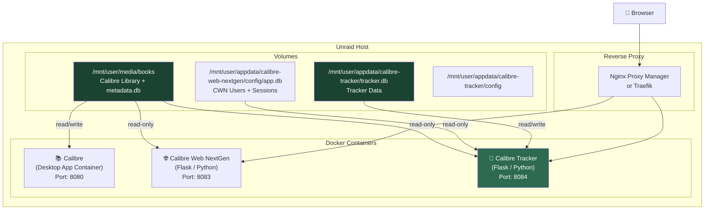
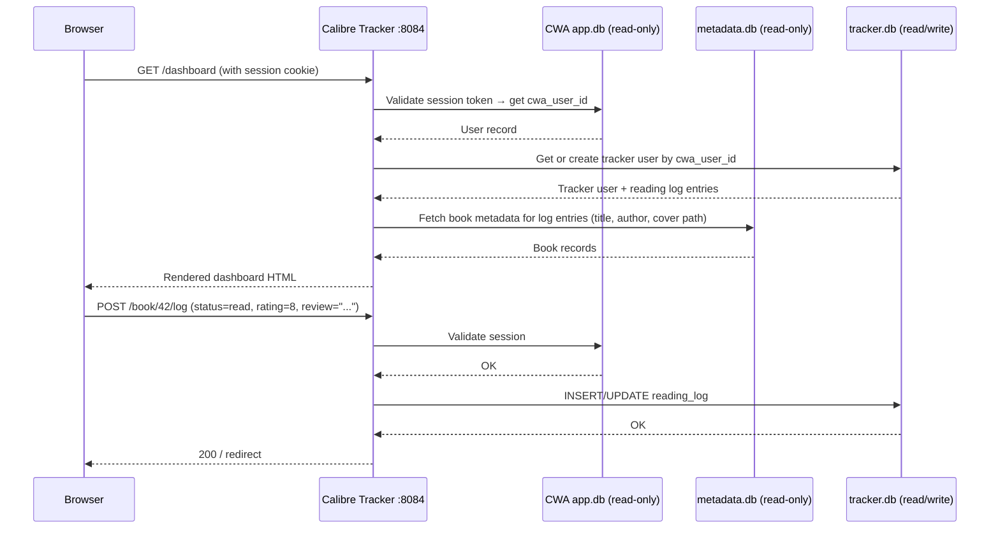

# Calibre Reading Tracker — Docker & Project Architecture

```table-of-contents
```

## Container Strategy

The tracker runs as its own Docker container on your Unraid server, alongside the existing Calibre and CWA containers. It shares volumes with both — read-only access to the Calibre library, and read access to CWA's app database for auth.



## Volume Mounts

| Host Path | Container Path | Mode | Purpose |
|---|---|---|---|
| `/mnt/user/media/books` | `/calibre-library` | `ro` | Calibre `metadata.db` + cover images |
| `/mnt/user/appdata/calibre-web-nextgen/config/app.db` | `/cwa/app.db` | `ro` | CWN user/session data for auth |
| `/mnt/user/appdata/calibre-tracker` | `/config` | `rw` | `tracker.db` + app config + logs |

> **Adjust host paths** to match your actual Unraid share layout. The appdata path for Calibre Web NextGen may differ from the upstream CWA path — check your container's actual `/config` mount. The important thing is that `metadata.db` and `app.db` are mounted read-only — the tracker should never write to either.

## `docker-compose.yml`

While Unraid's Apps tab handles container creation via templates, keeping a `docker-compose.yml` alongside your project is useful for local development and documentation.

```yaml
version: "3.9"

services:
  calibre-tracker:
    build:
      context: .
      dockerfile: Dockerfile
    container_name: calibre-tracker
    restart: unless-stopped
    ports:
      - "8084:8084"
    volumes:
      # Calibre library — read-only
      - /mnt/user/media/books:/calibre-library:ro
      # CWA (NextGen) app.db for auth — read-only
      - /mnt/user/appdata/calibre-web-nextgen/config/app.db:/cwa/app.db:ro
      # Tracker persistent data
      - /mnt/user/appdata/calibre-tracker:/config:rw
    environment:
      - TRACKER_SECRET_KEY=${TRACKER_SECRET_KEY}
      - CALIBRE_DB_PATH=/calibre-library/metadata.db
      - CWA_DB_PATH=/cwa/app.db
      - TRACKER_DB_PATH=/config/tracker.db
      - LOG_LEVEL=INFO
      - TZ=America/New_York
    healthcheck:
      test: ["CMD", "curl", "-f", "http://localhost:8084/health"]
      interval: 30s
      timeout: 10s
      retries: 3
```

## `Dockerfile`

```dockerfile
FROM python:3.12-slim

WORKDIR /app

# System dependencies
RUN apt-get update && apt-get install -y \
    sqlite3 \
    curl \
    && rm -rf /var/lib/apt/lists/*

# Python dependencies
COPY requirements.txt .
RUN pip install --no-cache-dir -r requirements.txt

# Application code
COPY . .

# Create config directory (will be overridden by volume mount)
RUN mkdir -p /config

EXPOSE 8084

CMD ["gunicorn", "--bind", "0.0.0.0:8084", "--workers", "2", "--timeout", "60", "app:create_app()"]
```

## Unraid Community Apps Template

When packaging for the Unraid Apps tab, you'll need a template XML. Key fields:

```xml
<Container>
  <Name>calibre-tracker</Name>
  <Repository>your-dockerhub/calibre-tracker:latest</Repository>
  <Category>MediaApp:Books</Category>
  <WebUI>http://[IP]:[PORT:8084]/</WebUI>
  <Config Name="AppData" Target="/config" Default="/mnt/user/appdata/calibre-tracker" Mode="rw" Type="Path"/>
  <Config Name="Calibre Library" Target="/calibre-library" Default="/mnt/user/media/books" Mode="ro" Type="Path"/>
  <Config Name="CWA App DB" Target="/cwa/app.db" Default="/mnt/user/appdata/calibre-web-nextgen/config/app.db" Mode="ro" Type="Path"/>
  <Config Name="Port" Target="8084" Default="8084" Type="Port"/>
  <Config Name="Secret Key" Target="TRACKER_SECRET_KEY" Type="Variable"/>
  <Config Name="Timezone" Target="TZ" Default="America/New_York" Type="Variable"/>
</Container>
```

## Project Directory Structure

```
calibre-tracker/
│
├── app/
│   ├── __init__.py              # create_app() factory
│   ├── extensions.py            # db, login_manager, etc.
│   ├── config.py                # Config classes (dev/prod)
│   │
│   ├── auth/
│   │   ├── __init__.py
│   │   ├── routes.py            # /login, /logout (delegates to CWA session)
│   │   └── cwa_bridge.py        # Reads CWA app.db to validate users/sessions
│   │
│   ├── calibre/
│   │   ├── __init__.py
│   │   └── models.py            # Read-only ORM models for metadata.db
│   │
│   ├── tracker/
│   │   ├── __init__.py
│   │   ├── models.py            # SQLAlchemy models for tracker.db
│   │   ├── routes.py            # Main tracker views
│   │   └── stats.py             # Reading stats / goal calculations
│   │
│   ├── api/
│   │   ├── __init__.py
│   │   └── v1.py                # JSON API endpoints (for future HTMX / JS use)
│   │
│   ├── templates/
│   │   ├── base.html            # Extends caliBlur! layout
│   │   ├── auth/
│   │   │   └── login.html
│   │   ├── tracker/
│   │   │   ├── dashboard.html
│   │   │   ├── book_detail.html
│   │   │   ├── shelves.html
│   │   │   ├── quotes.html
│   │   │   └── stats.html
│   │   └── components/
│   │       ├── book_card.html
│   │       ├── rating_stars.html
│   │       └── progress_bar.html
│   │
│   └── static/
│       ├── css/
│       │   └── tracker.css      # Extensions to caliBlur! — DO NOT override base
│       ├── js/
│       │   └── tracker.js
│       └── img/
│           └── tracker-logo.svg
│
├── migrations/                  # Alembic migrations for tracker.db
│   ├── env.py
│   ├── script.py.mako
│   └── versions/
│       └── 001_initial_schema.py
│
├── tests/
│   ├── test_auth.py
│   ├── test_reading_log.py
│   └── conftest.py
│
├── Dockerfile
├── docker-compose.yml
├── requirements.txt
├── .env.example
└── README.md
```

## Request / Response Flow



## Environment Variables

| Variable | Example | Description |
|---|---|---|
| `TRACKER_SECRET_KEY` | `openssl rand -hex 32` | Flask session signing key |
| `CALIBRE_DB_PATH` | `/calibre-library/metadata.db` | Path to Calibre's metadata.db |
| `CWA_DB_PATH` | `/cwa/app.db` | Path to CWN's app.db |
| `TRACKER_DB_PATH` | `/config/tracker.db` | Path to your tracker.db |
| `TZ` | `America/New_York` | Container timezone |
| `LOG_LEVEL` | `INFO` | Python logging level |
| `MAX_CONTENT_LENGTH` | `16777216` | Max upload size (16MB, for future cover uploads) |

> **Note:** Do not use the same `SECRET_KEY` as CWN unless you explicitly want to share sessions across both apps (same domain required). Using different keys is safer.

## Calibre Web NextGen — Relevant Environment Variables

These variables belong to the **NextGen container** (not your tracker), but are worth knowing because they affect how the auth bridge and reverse proxy behave.

| Variable | Default | Relevance to Tracker |
|---|---|---|
| `COOKIE_PREFIX` | `""` | If set, the session cookie name becomes `{prefix}session` rather than `session`. Your `cwa_bridge.py` must read this same prefix. |
| `TRUSTED_PROXY_COUNT` | `1` | Must be set correctly for session protection to work behind your reverse proxy. Misconfiguration causes forced re-logins. |
| `NETWORK_SHARE_MODE` | `false` | Set to `true` if your Calibre library is on an NFS/SMB share (common on Unraid). Disables SQLite WAL mode and switches inotify to polling. Has no direct effect on the tracker, but affects `metadata.db` locking behaviour. |

> **`COOKIE_PREFIX` is the most tracker-relevant setting.** Check its value in your NextGen container — if it's set to anything other than empty string, update `cwa_bridge.py`'s cookie lookup from `request.cookies.get("session")` to `request.cookies.get(f"{prefix}session")`.
