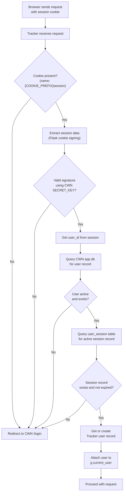
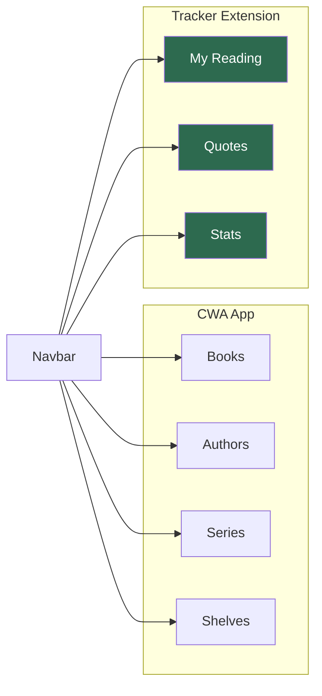

# Calibre Reading Tracker — Auth Bridge & Theming

```table-of-contents
```

> **Status (2026-06-14):** the auth bridge and theming choices described below are implemented and merged (Phases 2 and 5). The "Findings from inspecting CWN source" inline comments are accurate against the live `ghcr.io/new-usemame/calibre-web-nextgen` image; small drifts from the original assumptions are flagged in the **Important** call-outs below.

## Auth Strategy: Riding CWA's Session

The goal is that users who are already logged into CWA don't need a separate login for the tracker. The strategy depends on whether the two apps share an origin (same domain/subdomain), which affects whether the session cookie is accessible across both apps.

### Scenario A: Same Domain, Subpath (Recommended)

```
https://books.yourdomain.com/        → CWA  (:8083)
https://books.yourdomain.com/tracker → Calibre Tracker (:8084)
```

With this setup, both apps are on the same domain. Your reverse proxy (Nginx Proxy Manager or Traefik) routes `/tracker` to the tracker container. The CWA session cookie (domain: `books.yourdomain.com`) is sent to both apps automatically.

The tracker reads the incoming session cookie, looks it up in CWA's `app.db`, and if valid, considers the user authenticated. **No separate login needed.**

### Scenario B: Separate Subdomain

```
https://books.yourdomain.com         → CWA
https://tracker.yourdomain.com       → Calibre Tracker
```

Cookies don't cross subdomains by default. Options:
1. Set `CWA`'s cookie domain to `.yourdomain.com` (requires CWA config change, may not be possible without forking)
2. Add a lightweight login to the tracker that validates credentials against CWA's `app.db` directly (see below)
3. Use Nginx auth_request to proxy authentication through CWA

**Recommendation: Use Scenario A.** It's the simplest and requires no CWA modifications.

## CWA Session Architecture

CWA (and NextGen) uses **Flask-Login** with **Flask-WTF** for CSRF. The session is stored via **Flask's signed cookie** (itsdangerous). The cookie contains a user ID that Flask-Login uses to look up the user.

**Important — two-layer session validation:** NextGen uses a stock `flask_login.LoginManager` (from a vendored `cw_login/` package), and its `@user_loader`-decorated `cps.usermanagement.load_user(user_id, random, session_key)` cross-checks against a `user_session` table in `app.db`. The signed cookie alone isn't enough — a row in `user_session` matching `(user_id, session_key, random)` must also exist, so a remote logout (which deletes that row) immediately invalidates outstanding cookies. The bridge mirrors all three fields.

> **Earlier drafts of this doc referenced a `MyLoginManager` class — it doesn't exist in the current CWN source.** The relevant code lives in `cps/usermanagement.py` and the vendored `cps/cw_login/` package.

**Important — `COOKIE_PREFIX`:** The session cookie name is configurable. If NextGen's `COOKIE_PREFIX` environment variable is set, the cookie name becomes `{prefix}session` rather than plain `session`. Check the value in your running container before hardcoding the cookie name in `cwa_bridge.py`.



> **Important:** To validate CWN's signed session cookie, the tracker needs CWN's `SECRET_KEY`. Store it as an environment variable in both containers. This is the one secret that must be shared.

## The CWA Bridge — `app/auth/cwa_bridge.py`

This is an *outline* of the bridge's contract. The current implementation lives in `app/auth/cwa_bridge.py` and is the source of truth — the snippet below is intentionally simplified to keep this doc skimmable. Important departures from the snippet are noted under it.

```python
"""
cwa_bridge.py

Read-only interface to CWN's app.db for session validation and user lookup.
Never writes to CWN's database.

Findings from inspecting Calibre-Web-NextGen source (2026-06-14):
- Session cookie name:  f"{COOKIE_PREFIX}session" (env var, default "" → "session")
- Cookie format:        Flask SecureCookieSessionInterface — URLSafeTimedSerializer
                        with salt="cookie-session", TaggedJSONSerializer payload,
                        and HMAC-SHA1 key derivation. Decoding with any other
                        shape will fail signature verification.
- Session payload keys: "_user_id", "_random", "_id" (= the user_session.session_key)
- User table:           `user` with columns id, name, email, role, password, ...
- Session table:        `user_session` with columns id, user_id, session_key,
                        random, expiry  (expiry is Unix timestamp; 0 = no expiry).
- Auth model:           stock flask_login.LoginManager + vendored cw_login/. The
                        @user_loader (cps.usermanagement.load_user) cross-checks
                        user_session on (user_id, session_key, random) and IGNORES
                        expiry. The tracker is intentionally stricter and rejects
                        rows whose non-zero expiry is in the past.
"""

import hashlib
import sqlite3
import time
from contextlib import contextmanager

from flask import current_app
from flask.json.tag import TaggedJSONSerializer
from itsdangerous import URLSafeTimedSerializer, BadSignature, SignatureExpired


@contextmanager
def cwa_db_connection():
    """Read-only connection to CWN's app.db."""
    db_path = current_app.config["CWA_DB_PATH"]
    conn = sqlite3.connect(f"file:{db_path}?mode=ro", uri=True)
    conn.row_factory = sqlite3.Row
    try:
        yield conn
    finally:
        conn.close()


def _signing_serializer(secret_key: str) -> URLSafeTimedSerializer:
    """Match Flask's SecureCookieSessionInterface exactly — salt, payload
    serializer, and HMAC-SHA1 key derivation. Use the same shape or the
    HMAC will not verify."""
    return URLSafeTimedSerializer(
        secret_key,
        salt="cookie-session",
        serializer=TaggedJSONSerializer(),
        signer_kwargs={"key_derivation": "hmac", "digest_method": hashlib.sha1},
    )


def decode_cwa_session(session_cookie: str) -> dict | None:
    """Decode a CWN-signed Flask session cookie, or None if invalid/expired."""
    secret_key = current_app.config.get("CWA_SECRET_KEY") or ""
    if not secret_key:
        return None
    try:
        data = _signing_serializer(secret_key).loads(session_cookie, max_age=86400 * 30)
    except (BadSignature, SignatureExpired):
        return None
    return data if isinstance(data, dict) else None


def check_cwa_user_session(cwa_user_id, session_key, random_token, *, now=None):
    """Confirm an active user_session row exists for these credentials.

    Filters on (user_id, session_key, random) — matching CWN's own load_user —
    and additionally rejects rows whose non-zero expiry is in the past."""
    if not session_key:
        return False
    now = int(time.time()) if now is None else now
    with cwa_db_connection() as conn:
        row = conn.execute(
            """SELECT id FROM user_session
               WHERE user_id = ? AND session_key = ? AND random = ?
                 AND (expiry = 0 OR expiry > ?)""",
            (cwa_user_id, session_key, random_token, now),
        ).fetchone()
    return row is not None


def validate_cwa_session(session_cookie: str) -> dict | None:
    """decode → user_session cross-check → fetch user dict."""
    session_data = decode_cwa_session(session_cookie)
    if not session_data:
        return None
    try:
        user_id = int(session_data.get("_user_id") or session_data.get("user_id"))
    except (TypeError, ValueError):
        return None
    if not check_cwa_user_session(user_id, session_data.get("_id"), session_data.get("_random")):
        return None
    return get_cwa_user_by_id(user_id)
```

**Why the cookie-serializer shape matters.** Flask's `SecureCookieSessionInterface` doesn't just use a plain `URLSafeTimedSerializer(secret_key, salt="cookie-session")` — it also pins the payload serializer (`TaggedJSONSerializer`) and the signing key derivation (`hmac` + `sha1`). Encoding/decoding with any other combination produces a different signature and the HMAC verification fails. This bridge was originally written with the simplified form and had to be widened when round-tripping against the real container's cookies failed.

**Why the `random` field matters.** Stock Flask-Login (and the vendored `cw_login/` CWN ships) writes three keys into the session: `_user_id`, `_id` (= the `user_session.session_key`), and `_random`. CWN's `load_user` filters `user_session` on `(user_id, session_key, random)` — using only `_id` is sufficient most of the time but will let through cookies where `_random` doesn't match the live row (rare but real after a remember-me re-bind). Matching all three avoids the edge case.

**`COOKIE_PREFIX`.** If NextGen is configured with a non-empty `COOKIE_PREFIX` env var, the cookie name passed to `validate_cwa_session()` must be read from `request.cookies.get(f"{prefix}session")` rather than `request.cookies.get("session")`. The tracker reads this from the `CWA_COOKIE_PREFIX` env var (default `""`). Check the live value with `docker exec calibre-web printenv COOKIE_PREFIX`.

## CWN Read-Status Import — `app/auth/cwa_bridge.py` (continued)

This function also lives in `cwa_bridge.py` since it reads from `app.db`. It is called once per user from `app/tracker/service.py` when `User.cwn_import_completed` is `False`.

```python
def import_cwn_read_status(user: "User", db_session) -> int:
    """
    One-time import of read status from CWN's book_read_link table.

    Reads all book_id values where read_status=1 for this CWN user and
    creates a reading_log row (status='read') for any that don't already
    exist in the tracker. Never overwrites existing tracker data.

    Should only be called when user.cwn_import_completed is False.
    Caller is responsible for setting user.cwn_import_completed = True
    and committing after this function returns.

    Args:
        user:       The tracker User model instance (needs .id and .cwa_user_id).
        db_session: The tracker's SQLAlchemy session for writing ReadingLog rows.

    Returns:
        Number of reading_log rows created.
    """
    from ..tracker.models import ReadingLog  # local import to avoid circular

    with cwa_db_connection() as conn:
        rows = conn.execute(
            """SELECT book_id FROM book_read_link
               WHERE user_id = ? AND read_status = 1""",
            (user.cwa_user_id,)
        ).fetchall()

    imported = 0
    for row in rows:
        already_logged = db_session.query(ReadingLog).filter_by(
            user_id=user.id,
            calibre_book_id=row["book_id"]
        ).first()

        if not already_logged:
            db_session.add(ReadingLog(
                user_id=user.id,
                calibre_book_id=row["book_id"],
                status="read",
                # Dates and rating intentionally left null — user can fill
                # in context (when they read it, their rating) at their leisure.
            ))
            imported += 1

    return imported
```

### Calling the import from the service layer

```python
# In app/tracker/service.py, called on first dashboard load:

from ..auth.cwa_bridge import import_cwn_read_status
from ..extensions import db

def maybe_run_cwn_import(user: User) -> int | None:
    """
    Run the one-time CWN read-status import if it hasn't been done yet.
    Returns the count of imported books, or None if already completed.
    """
    if user.cwn_import_completed:
        return None

    count = import_cwn_read_status(user, db.session)
    user.cwn_import_completed = True
    db.session.commit()
    return count
```

The dashboard view calls `maybe_run_cwn_import(current_user)` and, if the return value is not `None`, shows a one-time flash message: *"We imported N books you've already read in Calibre Web. You can add dates and ratings whenever you like."*

> **Future task — epub reader fields:** `book_read_link` also stores `last_time_started_reading` and `times_started_reading`, populated by CWN's built-in browser reader. These are intentionally not imported — the built-in reader is rarely used and a significantly improved version is in development upstream. Revisit when the new reader ships and those fields become more populated.

## Flask-Login Integration — `app/auth/routes.py`

```python
"""
auth/routes.py

Middleware-style auth using CWN session cookies.
No separate login form needed when running under the same domain.
"""

from flask import request, redirect, url_for, current_app, g
from flask_login import login_user, logout_user, current_user
from . import auth_bp
from .cwa_bridge import validate_cwa_session
from ..tracker.models import User
from ..extensions import db


def load_user_from_cwa_cookie():
    """
    Before-request hook. Checks the CWN session cookie and
    authenticates the user into the tracker's Flask-Login session.

    Handles CWN's COOKIE_PREFIX env var — if set, cookie name is
    "{prefix}session" rather than "session".

    Register this with: app.before_request(load_user_from_cwa_cookie)
    """
    if current_user.is_authenticated:
        return  # Already loaded

    # Respect CWN's COOKIE_PREFIX setting (default: empty string → "session")
    prefix = current_app.config.get("CWA_COOKIE_PREFIX", "")
    cookie_name = f"{prefix}session"

    cwa_cookie = request.cookies.get(cookie_name)
    if not cwa_cookie:
        return

    cwa_user = validate_cwa_session(cwa_cookie)
    if not cwa_user:
        return

    # Get or create the tracker's user record
    tracker_user = User.query.filter_by(
        cwa_user_id=cwa_user["id"]
    ).first()

    if not tracker_user:
        tracker_user = User(
            cwa_user_id=cwa_user["id"],
            username=cwa_user["name"],
            display_name=cwa_user["name"],
        )
        db.session.add(tracker_user)
        db.session.commit()

    login_user(tracker_user, remember=True)


@auth_bp.route("/logout")
def logout():
    logout_user()
    # Redirect to CWN's logout to clear the shared cookie too
    cwa_base = current_app.config.get("CWA_BASE_URL", "/")
    return redirect(f"{cwa_base}/logout")
```

## Fallback: Standalone Login (Scenario B)

If you end up on separate subdomains and can't share the session cookie, this lightweight form validates credentials directly against CWA's `app.db` using the same bcrypt hashing CWA uses:

```python
import bcrypt
from .cwa_bridge import cwa_db_connection

def authenticate_cwa_credentials(username: str, password: str) -> dict | None:
    """
    Validate username/password directly against CWA's user table.
    Uses bcrypt — matches CWA's password hashing exactly.
    Falls back to this only when session-sharing isn't possible.
    """
    with cwa_db_connection() as conn:
        row = conn.execute(
            "SELECT id, name, email, password, role FROM user WHERE name = ?",
            (username,)
        ).fetchone()

    if not row:
        return None

    stored_hash = row["password"].encode("utf-8")
    if bcrypt.checkpw(password.encode("utf-8"), stored_hash):
        return dict(row)

    return None
```

## Theming: Extending caliBlur! Dark

> **What Phase 5 ended up doing (vs. earlier drafts of this section).** The original plan was to copy CWN's full `layout.html` into the tracker and extend it. In practice the live `layout.html` is ~777 lines and tightly coupled to CWN-specific globals (`g.current_theme`, `current_user.role_admin()`, i18n filters, custom-CSS hooks, …) which would need stubbing from the tracker side. The trade-off taken: vendor CWN's *CSS files* verbatim (the visual surface), and build a small **tracker-native `layout.html`** that mimics CWN's caliBlur shell — same fonts, colors, `body.blur` class, Bootstrap 3 navbar, and the override blocks (`head_extras`, `navbar_primary`, `navbar_extra`, `flash`, `body`, `js`) that this doc's `base.html` snippet expects. The CSS file references in the page output are unchanged, so the actual caliBlur dark theme styles every page.

### How CWN's Theme Works

CWN serves its static assets (CSS, JS, fonts) from its own container. The caliBlur! theme is a set of CSS files loaded conditionally based on the user's theme setting. The confirmed CSS structure from source is:

| File | Purpose |
|---|---|
| `cps/static/css/caliBlur.css` | Main caliBlur theme styles |
| `cps/static/css/caliBlur_override.css` | Responsive overrides for caliBlur |
| `cps/static/css/cwa.css` | CWN-specific enhancements (loaded for both themes) |
| `cps/static/css/style.css` | Base application styles |

Three strategies are viable:

1. **Vendor the CSS files into the tracker repo** *(what Phase 5 picked)*. Copy the four files above into `app/static/css/cwa/` and reference them from the tracker's own `layout.html`. Self-contained; the tracker can be deployed alongside any CWN install. When CWN releases a new caliBlur, run `docker cp` to refresh.
2. **Proxy CWA's static assets via the reverse proxy** (less duplication; CWN updates flow automatically).
3. **Copy/mount the theme files at runtime via a Docker volume**.

**What Phase 5 picked — vendored copies in the repo (recommended for now):**

The four CWN CSS files live at `app/static/css/cwa/` in the tracker repo. `app/templates/layout.html` loads them in this order:

```html
<link rel="stylesheet" href="https://cdn.jsdelivr.net/npm/bootstrap@3.4.1/dist/css/bootstrap.min.css">
<link rel="stylesheet" href="{{ url_for('static', filename='css/cwa/style.css') }}">
<link rel="stylesheet" href="{{ url_for('static', filename='css/cwa/caliBlur.css') }}">
<link rel="stylesheet" href="{{ url_for('static', filename='css/cwa/caliBlur_override.css') }}">
<link rel="stylesheet" href="{{ url_for('static', filename='css/cwa/cwa.css') }}">
```

Bootstrap 3 and jQuery come from a CDN to keep the repo lean. To refresh the vendored CSS after a CWN update:

```bash
docker cp calibre-web:/app/calibre-web-automated/cps/static/css/caliBlur.css           app/static/css/cwa/caliBlur.css
docker cp calibre-web:/app/calibre-web-automated/cps/static/css/caliBlur_override.css  app/static/css/cwa/caliBlur_override.css
docker cp calibre-web:/app/calibre-web-automated/cps/static/css/cwa.css                app/static/css/cwa/cwa.css
docker cp calibre-web:/app/calibre-web-automated/cps/static/css/style.css              app/static/css/cwa/style.css
```

**Alternative — proxy via the reverse proxy:**

```nginx
# In your Nginx Proxy Manager / Traefik config:
# Serve CWN's static files for both apps

location /static/caliBlur/ {
    proxy_pass http://calibre-web:8083/static/caliBlur/;
}
location /tracker/ {
    proxy_pass http://calibre-tracker:8084/;
}
```

With this setup, the tracker would reference `/static/caliBlur/...` instead of `/static/css/cwa/...`. CWN updates flow automatically.

**Alternative — bind-mount the CWN static dir read-only:**

```yaml
volumes:
  - /mnt/user/appdata/calibre-web-nextgen/app/cps/static:/cwa-static:ro
```

Then reference `/cwa-static/...` from templates. Similar trade-off to the proxy, with the file paths visible from inside the container.

### Your Tracker's CSS — `app/static/css/tracker.css`

Only define what's *new* or *different*. Never override base caliBlur! variables — extend them.

```css
/* tracker.css — Extensions only. Base theme comes from CWA. */

/* ── Tracker-specific CSS custom properties ── */
:root {
  --tracker-accent: #c9a96e;          /* Warm gold for reading highlights */
  --tracker-dnf: #e05252;             /* Red for Did Not Finish */
  --tracker-reading: #52a0e0;         /* Blue for currently reading */
  --tracker-read: #52e07a;            /* Green for finished */
  --tracker-want: #a052e0;            /* Purple for want-to-read */
  --tracker-star-filled: #f5c518;     /* IMDb-style gold stars */
  --tracker-star-empty: #444;
  --tracker-progress-bg: #1e1e2e;
  --tracker-progress-fill: var(--tracker-accent);
  --tracker-card-hover-border: rgba(201, 169, 110, 0.4);
}

/* ── Reading status badges ── */
.badge-want-to-read  { background-color: var(--tracker-want);    color: #fff; }
.badge-reading       { background-color: var(--tracker-reading); color: #fff; }
.badge-read          { background-color: var(--tracker-read);    color: #000; }
.badge-dnf           { background-color: var(--tracker-dnf);     color: #fff; }
.badge-re-reading    { background-color: var(--tracker-accent);  color: #000; }

/* ── Star rating ── */
.star-rating {
  display: inline-flex;
  gap: 2px;
  font-size: 1.1rem;
}
.star-rating .star { color: var(--tracker-star-empty); cursor: pointer; }
.star-rating .star.filled,
.star-rating .star:hover,
.star-rating .star:hover ~ .star { color: var(--tracker-star-filled); }

/* ── Reading progress bar ── */
.reading-progress {
  background: var(--tracker-progress-bg);
  border-radius: 4px;
  height: 6px;
  overflow: hidden;
}
.reading-progress-fill {
  height: 100%;
  background: linear-gradient(
    90deg,
    var(--tracker-accent),
    color-mix(in srgb, var(--tracker-accent) 70%, white)
  );
  border-radius: 4px;
  transition: width 0.4s ease;
}

/* ── Book card (tracker variant) ── */
.book-card-tracker {
  border: 1px solid transparent;
  transition: border-color 0.2s ease, transform 0.15s ease;
}
.book-card-tracker:hover {
  border-color: var(--tracker-card-hover-border);
  transform: translateY(-2px);
}

/* ── Quote block ── */
.quote-block {
  border-left: 3px solid var(--tracker-accent);
  padding: 0.75rem 1rem;
  margin: 1rem 0;
  font-style: italic;
  opacity: 0.9;
}
.quote-block cite {
  display: block;
  font-style: normal;
  font-size: 0.8rem;
  opacity: 0.6;
  margin-top: 0.4rem;
}

/* ── Stats / goal ring ── */
.goal-ring-label {
  font-size: 0.75rem;
  text-transform: uppercase;
  letter-spacing: 0.05em;
  opacity: 0.7;
}
```

### Base Template — `app/templates/base.html`

```html
{# base.html — inherits caliBlur! look entirely, adds tracker nav item #}
  {# ← CWA's actual base template name #}


  <link rel="stylesheet" href="{{ url_for('static', filename='css/tracker.css') }}">



  {# Inject "My Reading" nav item into CWA's existing navbar #}
  <li class="nav-item">
    <a class="nav-link active"
       href="{{ url_for('tracker.dashboard') }}">
      <i class="fas fa-book-open"></i> My Reading
    </a>
  </li>

```

> **Note on template inheritance.** Phase 5 chose to not literally extend CWN's `layout.html` from inside the tracker — the live template has too many CWN-specific globals to satisfy from outside CWN (see the call-out at the top of this section). Instead, `app/templates/layout.html` is a tracker-native shell with the same visual treatment (Bootstrap 3 navbar, vendored caliBlur CSS, `body.blur`) and defines the `head_extras` / `navbar_primary` / `navbar_extra` / `flash` / `body` / `js` blocks that `base.html` overrides. `base.html` *does* `` — but `layout.html` here is the tracker's own, not CWN's.

## Navigation Integration Diagram



Since the tracker is a separate app, this "integration" is achieved by having the tracker's navbar include links back to CWA for Books/Authors/Series, and CWA's navbar can optionally be patched (via a CWA custom template override — CWA supports this) to add a "My Reading" link pointing to `/tracker/`.

## CWA Custom Template Override (Optional)

CWN supports dropping custom templates into a `/config/templates/` directory that override the defaults. This means you can add the tracker nav link to CWN's UI **without forking CWN**:

```
/mnt/user/appdata/calibre-web-nextgen/config/
└── templates/
    └── layout.html    ← Your modified copy of CWN's layout.html
```

In this file, add:

```html
<li class="nav-item">
  <a class="nav-link" href="/tracker/">
    <i class="fas fa-book-open"></i> My Reading
  </a>
</li>
```

This survives CWA updates (your override file isn't replaced) and provides seamless navigation between the two apps.
