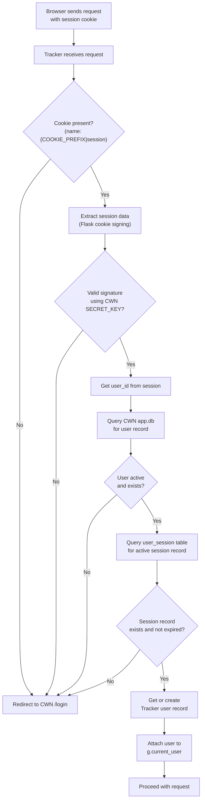
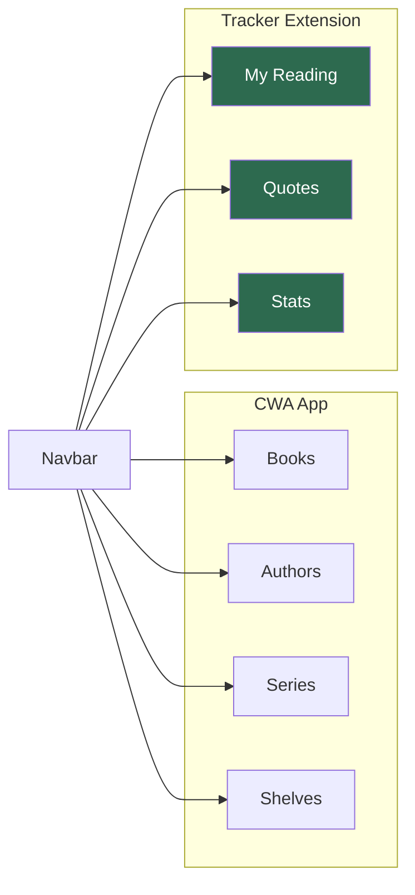

# Calibre Reading Tracker — Auth Bridge & Theming

```table-of-contents
```

## Auth Strategy: Riding CWA's Session

The goal is that users who are already logged into CWA don't need a separate login for the tracker. The strategy depends on whether the two apps share an origin (same domain/subdomain), which affects whether the session cookie is accessible across both apps.

### Scenario A: Same Domain, Subpath (Recommended)

```
https://books.yourdomain.com/        → CWA  (:8083)
https://books.yourdomain.com/tracker → Calibre Tracker (:8084)
```

With this setup, both apps are on the same domain. Your reverse proxy (Nginx Proxy Manager or Traefik) routes `/tracker` to the tracker container. The CWA session cookie (domain: `books.yourdomain.com`) is sent to both apps automatically.

The tracker reads the incoming session cookie, looks it up in CWA's `app.db`, and if valid, considers the user authenticated. **No separate login needed.**

### Scenario B: Separate Subdomain

```
https://books.yourdomain.com         → CWA
https://tracker.yourdomain.com       → Calibre Tracker
```

Cookies don't cross subdomains by default. Options:
1. Set `CWA`'s cookie domain to `.yourdomain.com` (requires CWA config change, may not be possible without forking)
2. Add a lightweight login to the tracker that validates credentials against CWA's `app.db` directly (see below)
3. Use Nginx auth_request to proxy authentication through CWA

**Recommendation: Use Scenario A.** It's the simplest and requires no CWA modifications.

## CWA Session Architecture

CWA (and NextGen) uses **Flask-Login** with **Flask-WTF** for CSRF. The session is stored via **Flask's signed cookie** (itsdangerous). The cookie contains a user ID that Flask-Login uses to look up the user.

**Important — two-layer session validation:** NextGen's `MyLoginManager` implements *enhanced* session protection. It validates the Flask signed cookie **and** cross-checks against a `user_session` table in `app.db` to confirm the session hasn't been explicitly invalidated server-side (e.g. by a remote logout or an admin force-logout). Your bridge needs to handle both layers.

**Important — `COOKIE_PREFIX`:** The session cookie name is configurable. If NextGen's `COOKIE_PREFIX` environment variable is set, the cookie name becomes `{prefix}session` rather than plain `session`. Check the value in your running container before hardcoding the cookie name in `cwa_bridge.py`.



> **Important:** To validate CWN's signed session cookie, the tracker needs CWN's `SECRET_KEY`. Store it as an environment variable in both containers. This is the one secret that must be shared.

## The CWA Bridge — `app/auth/cwa_bridge.py`

```python
"""
cwa_bridge.py

Read-only interface to CWN's app.db for session validation and user lookup.
Never writes to CWN's database.

Findings from inspecting Calibre-Web-NextGen source:
- Session cookie name: f"{COOKIE_PREFIX}session" (env var, default empty → "session")
- Flask-Login user ID key in session: "_user_id"
- User table: `user` with columns id, name, email, role, password, ...
- Session table: `user_session` with columns id, user_id, session_key, random, expiry
  NextGen's MyLoginManager validates BOTH the signed cookie AND a live row in
  user_session, so we must check both to match NextGen's own auth behaviour.
"""

import sqlite3
import time
from contextlib import contextmanager
from flask import current_app
from itsdangerous import URLSafeTimedSerializer, BadSignature, SignatureExpired


@contextmanager
def cwa_db_connection():
    """Context manager for read-only CWN database access."""
    db_path = current_app.config["CWA_DB_PATH"]
    conn = sqlite3.connect(f"file:{db_path}?mode=ro", uri=True)
    conn.row_factory = sqlite3.Row
    try:
        yield conn
    finally:
        conn.close()


def decode_cwa_session(session_cookie: str) -> dict | None:
    """
    Decode a CWN Flask session cookie using the shared SECRET_KEY.
    Returns the session dict, or None if invalid/expired.
    """
    secret_key = current_app.config["CWA_SECRET_KEY"]
    s = URLSafeTimedSerializer(secret_key, salt="cookie-session")
    try:
        data = s.loads(session_cookie, max_age=86400 * 30)  # 30-day sessions
        return data
    except (BadSignature, SignatureExpired):
        return None


def get_cwa_user_by_id(cwa_user_id: int) -> dict | None:
    """
    Fetch a user record from CWN's database by ID.
    Returns a dict with user fields, or None if not found.

    CWN user table schema (from source):
        id, name, email, role, password, kindle_mail,
        locale, default_language, sidebar_view,
        denied_tags, allowed_tags, denied_column_value,
        allowed_column_value, email_verified
    """
    with cwa_db_connection() as conn:
        row = conn.execute(
            "SELECT id, name, email, role FROM user WHERE id = ?",
            (cwa_user_id,)
        ).fetchone()

        if row is None:
            return None

        return dict(row)


def check_cwa_user_session(cwa_user_id: int, session_key: str) -> bool:
    """
    Verify that an active user_session row exists in CWN's app.db for this
    user + session key pair. NextGen's MyLoginManager checks this table in
    addition to the signed cookie, so we match that behaviour.

    user_session schema: id, user_id, session_key, random, expiry
    expiry is a Unix timestamp; 0 means no expiry (remember_me).
    """
    now = int(time.time())
    with cwa_db_connection() as conn:
        row = conn.execute(
            """SELECT id FROM user_session
               WHERE user_id = ?
               AND session_key = ?
               AND (expiry = 0 OR expiry > ?)""",
            (cwa_user_id, session_key, now)
        ).fetchone()
    return row is not None


def validate_cwa_session(session_cookie: str) -> dict | None:
    """
    Full pipeline: decode cookie → validate → check user_session table → fetch user.
    Returns CWN user dict if valid, None otherwise.
    """
    session_data = decode_cwa_session(session_cookie)
    if not session_data:
        return None

    user_id = session_data.get("_user_id") or session_data.get("user_id")
    if not user_id:
        return None

    # NextGen also validates against the user_session table.
    # The session_key stored there corresponds to the Flask session's "_id" field.
    session_key = session_data.get("_id")
    if session_key and not check_cwa_user_session(int(user_id), session_key):
        return None  # Session was explicitly invalidated server-side

    return get_cwa_user_by_id(int(user_id))
```

 **Note on `COOKIE_PREFIX`:** If NextGen is configured with a non-empty `COOKIE_PREFIX` env var, the cookie name passed to `validate_cwa_session()` must be read from `request.cookies.get(f"{prefix}session")` rather than `request.cookies.get("session")`. Add `CWA_COOKIE_PREFIX` to your tracker's env vars and make this configurable. Check the value in your running NextGen container with `docker exec calibre-web printenv COOKIE_PREFIX`.

## CWN Read-Status Import — `app/auth/cwa_bridge.py` (continued)

This function also lives in `cwa_bridge.py` since it reads from `app.db`. It is called once per user from `app/tracker/service.py` when `User.cwn_import_completed` is `False`.

```python
def import_cwn_read_status(user: "User", db_session) -> int:
    """
    One-time import of read status from CWN's book_read_link table.

    Reads all book_id values where read_status=1 for this CWN user and
    creates a reading_log row (status='read') for any that don't already
    exist in the tracker. Never overwrites existing tracker data.

    Should only be called when user.cwn_import_completed is False.
    Caller is responsible for setting user.cwn_import_completed = True
    and committing after this function returns.

    Args:
        user:       The tracker User model instance (needs .id and .cwa_user_id).
        db_session: The tracker's SQLAlchemy session for writing ReadingLog rows.

    Returns:
        Number of reading_log rows created.
    """
    from ..tracker.models import ReadingLog  # local import to avoid circular

    with cwa_db_connection() as conn:
        rows = conn.execute(
            """SELECT book_id FROM book_read_link
               WHERE user_id = ? AND read_status = 1""",
            (user.cwa_user_id,)
        ).fetchall()

    imported = 0
    for row in rows:
        already_logged = db_session.query(ReadingLog).filter_by(
            user_id=user.id,
            calibre_book_id=row["book_id"]
        ).first()

        if not already_logged:
            db_session.add(ReadingLog(
                user_id=user.id,
                calibre_book_id=row["book_id"],
                status="read",
                # Dates and rating intentionally left null — user can fill
                # in context (when they read it, their rating) at their leisure.
            ))
            imported += 1

    return imported
```

### Calling the import from the service layer

```python
# In app/tracker/service.py, called on first dashboard load:

from ..auth.cwa_bridge import import_cwn_read_status
from ..extensions import db

def maybe_run_cwn_import(user: User) -> int | None:
    """
    Run the one-time CWN read-status import if it hasn't been done yet.
    Returns the count of imported books, or None if already completed.
    """
    if user.cwn_import_completed:
        return None

    count = import_cwn_read_status(user, db.session)
    user.cwn_import_completed = True
    db.session.commit()
    return count
```

The dashboard view calls `maybe_run_cwn_import(current_user)` and, if the return value is not `None`, shows a one-time flash message: *"We imported N books you've already read in Calibre Web. You can add dates and ratings whenever you like."*

> **Future task — epub reader fields:** `book_read_link` also stores `last_time_started_reading` and `times_started_reading`, populated by CWN's built-in browser reader. These are intentionally not imported — the built-in reader is rarely used and a significantly improved version is in development upstream. Revisit when the new reader ships and those fields become more populated.

## Flask-Login Integration — `app/auth/routes.py`

```python
"""
auth/routes.py

Middleware-style auth using CWN session cookies.
No separate login form needed when running under the same domain.
"""

from flask import request, redirect, url_for, current_app, g
from flask_login import login_user, logout_user, current_user
from . import auth_bp
from .cwa_bridge import validate_cwa_session
from ..tracker.models import User
from ..extensions import db


def load_user_from_cwa_cookie():
    """
    Before-request hook. Checks the CWN session cookie and
    authenticates the user into the tracker's Flask-Login session.

    Handles CWN's COOKIE_PREFIX env var — if set, cookie name is
    "{prefix}session" rather than "session".

    Register this with: app.before_request(load_user_from_cwa_cookie)
    """
    if current_user.is_authenticated:
        return  # Already loaded

    # Respect CWN's COOKIE_PREFIX setting (default: empty string → "session")
    prefix = current_app.config.get("CWA_COOKIE_PREFIX", "")
    cookie_name = f"{prefix}session"

    cwa_cookie = request.cookies.get(cookie_name)
    if not cwa_cookie:
        return

    cwa_user = validate_cwa_session(cwa_cookie)
    if not cwa_user:
        return

    # Get or create the tracker's user record
    tracker_user = User.query.filter_by(
        cwa_user_id=cwa_user["id"]
    ).first()

    if not tracker_user:
        tracker_user = User(
            cwa_user_id=cwa_user["id"],
            username=cwa_user["name"],
            display_name=cwa_user["name"],
        )
        db.session.add(tracker_user)
        db.session.commit()

    login_user(tracker_user, remember=True)


@auth_bp.route("/logout")
def logout():
    logout_user()
    # Redirect to CWN's logout to clear the shared cookie too
    cwa_base = current_app.config.get("CWA_BASE_URL", "/")
    return redirect(f"{cwa_base}/logout")
```

## Fallback: Standalone Login (Scenario B)

If you end up on separate subdomains and can't share the session cookie, this lightweight form validates credentials directly against CWA's `app.db` using the same bcrypt hashing CWA uses:

```python
import bcrypt
from .cwa_bridge import cwa_db_connection

def authenticate_cwa_credentials(username: str, password: str) -> dict | None:
    """
    Validate username/password directly against CWA's user table.
    Uses bcrypt — matches CWA's password hashing exactly.
    Falls back to this only when session-sharing isn't possible.
    """
    with cwa_db_connection() as conn:
        row = conn.execute(
            "SELECT id, name, email, password, role FROM user WHERE name = ?",
            (username,)
        ).fetchone()

    if not row:
        return None

    stored_hash = row["password"].encode("utf-8")
    if bcrypt.checkpw(password.encode("utf-8"), stored_hash):
        return dict(row)

    return None
```

## Theming: Extending caliBlur! Dark

### How CWN's Theme Works

CWN serves its static assets (CSS, JS, fonts) from its own container. The caliBlur! theme is a set of CSS files loaded conditionally based on the user's theme setting. The confirmed CSS structure from source is:

| File | Purpose |
|---|---|
| `cps/static/css/caliBlur.css` | Main caliBlur theme styles |
| `cps/static/css/caliBlur_override.css` | Responsive overrides for caliBlur |
| `cps/static/css/cwa.css` | CWN-specific enhancements (loaded for both themes) |
| `cps/static/css/style.css` | Base application styles |

Your tracker needs to either:

1. **Proxy CWA's static assets** (cleanest, no duplication), or
2. **Copy the theme files** into your own container's static directory

**Option 1 — Proxy via Nginx (Recommended):**

```nginx
# In your Nginx Proxy Manager / Traefik config:
# Serve CWN's static files for both apps

location /static/caliBlur/ {
    proxy_pass http://calibre-web:8083/static/caliBlur/;
}
location /tracker/ {
    proxy_pass http://calibre-tracker:8084/;
}
```

With this setup, your tracker templates reference `/static/caliBlur/...` and Nginx serves them from CWN. When CWN updates its theme, both apps update automatically.

**Option 2 — Copy Theme Files:**

Mount CWN's static directory as a read-only volume into the tracker container:

```yaml
volumes:
  - /mnt/user/appdata/calibre-web-nextgen/app/cps/static:/cwa-static:ro
```

Then in your tracker's templates, reference files at `/cwa-static/...`.

### Your Tracker's CSS — `app/static/css/tracker.css`

Only define what's *new* or *different*. Never override base caliBlur! variables — extend them.

```css
/* tracker.css — Extensions only. Base theme comes from CWA. */

/* ── Tracker-specific CSS custom properties ── */
:root {
  --tracker-accent: #c9a96e;          /* Warm gold for reading highlights */
  --tracker-dnf: #e05252;             /* Red for Did Not Finish */
  --tracker-reading: #52a0e0;         /* Blue for currently reading */
  --tracker-read: #52e07a;            /* Green for finished */
  --tracker-want: #a052e0;            /* Purple for want-to-read */
  --tracker-star-filled: #f5c518;     /* IMDb-style gold stars */
  --tracker-star-empty: #444;
  --tracker-progress-bg: #1e1e2e;
  --tracker-progress-fill: var(--tracker-accent);
  --tracker-card-hover-border: rgba(201, 169, 110, 0.4);
}

/* ── Reading status badges ── */
.badge-want-to-read  { background-color: var(--tracker-want);    color: #fff; }
.badge-reading       { background-color: var(--tracker-reading); color: #fff; }
.badge-read          { background-color: var(--tracker-read);    color: #000; }
.badge-dnf           { background-color: var(--tracker-dnf);     color: #fff; }
.badge-re-reading    { background-color: var(--tracker-accent);  color: #000; }

/* ── Star rating ── */
.star-rating {
  display: inline-flex;
  gap: 2px;
  font-size: 1.1rem;
}
.star-rating .star { color: var(--tracker-star-empty); cursor: pointer; }
.star-rating .star.filled,
.star-rating .star:hover,
.star-rating .star:hover ~ .star { color: var(--tracker-star-filled); }

/* ── Reading progress bar ── */
.reading-progress {
  background: var(--tracker-progress-bg);
  border-radius: 4px;
  height: 6px;
  overflow: hidden;
}
.reading-progress-fill {
  height: 100%;
  background: linear-gradient(
    90deg,
    var(--tracker-accent),
    color-mix(in srgb, var(--tracker-accent) 70%, white)
  );
  border-radius: 4px;
  transition: width 0.4s ease;
}

/* ── Book card (tracker variant) ── */
.book-card-tracker {
  border: 1px solid transparent;
  transition: border-color 0.2s ease, transform 0.15s ease;
}
.book-card-tracker:hover {
  border-color: var(--tracker-card-hover-border);
  transform: translateY(-2px);
}

/* ── Quote block ── */
.quote-block {
  border-left: 3px solid var(--tracker-accent);
  padding: 0.75rem 1rem;
  margin: 1rem 0;
  font-style: italic;
  opacity: 0.9;
}
.quote-block cite {
  display: block;
  font-style: normal;
  font-size: 0.8rem;
  opacity: 0.6;
  margin-top: 0.4rem;
}

/* ── Stats / goal ring ── */
.goal-ring-label {
  font-size: 0.75rem;
  text-transform: uppercase;
  letter-spacing: 0.05em;
  opacity: 0.7;
}
```

### Base Template — `app/templates/base.html`

```html
{# base.html — inherits caliBlur! look entirely, adds tracker nav item #}
  {# ← CWA's actual base template name #}


  <link rel="stylesheet" href="{{ url_for('static', filename='css/tracker.css') }}">



  {# Inject "My Reading" nav item into CWA's existing navbar #}
  <li class="nav-item">
    <a class="nav-link active"
       href="{{ url_for('tracker.dashboard') }}">
      <i class="fas fa-book-open"></i> My Reading
    </a>
  </li>

```

> **Note on template inheritance:** The base template is confirmed as `layout.html` (verified from CWN source at `cps/templates/layout.html`). Your `` is correct. Since the tracker is a *separate* container, you'll need to either copy CWN's base template into your container or use the proxy approach above so Jinja2 can find it. The **cleanest approach** is to copy just the base template and the theme CSS into your container — it's a small surface area and rarely changes.

## Navigation Integration Diagram



Since the tracker is a separate app, this "integration" is achieved by having the tracker's navbar include links back to CWA for Books/Authors/Series, and CWA's navbar can optionally be patched (via a CWA custom template override — CWA supports this) to add a "My Reading" link pointing to `/tracker/`.

## CWA Custom Template Override (Optional)

CWN supports dropping custom templates into a `/config/templates/` directory that override the defaults. This means you can add the tracker nav link to CWN's UI **without forking CWN**:

```
/mnt/user/appdata/calibre-web-nextgen/config/
└── templates/
    └── layout.html    ← Your modified copy of CWN's layout.html
```

In this file, add:

```html
<li class="nav-item">
  <a class="nav-link" href="/tracker/">
    <i class="fas fa-book-open"></i> My Reading
  </a>
</li>
```

This survives CWA updates (your override file isn't replaced) and provides seamless navigation between the two apps.
