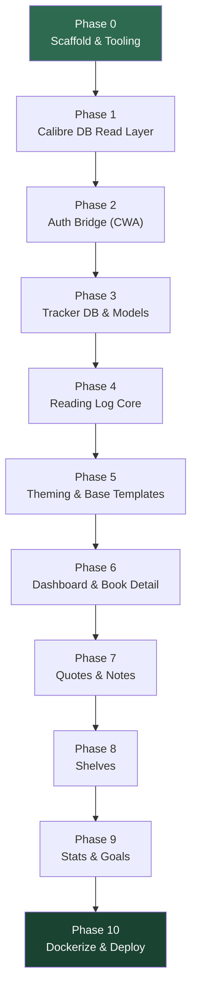

# Calibre Reading Tracker — Implementation Plan

```table-of-contents
```

> **For: Claude Code (CLI)**
> This document is a phased implementation plan. Work through phases in order. Each phase has a clear goal, concrete tasks, and acceptance criteria. Do not advance to the next phase until the current phase's acceptance criteria pass. Commit at the end of each phase.

## Project Context

**What we're building:** A self-hosted personal reading tracker (think StoryGraph / Goodreads, but no social features) that runs as a companion to Calibre-Web Automated (CWA). It reads book metadata from the shared Calibre database and stores reading-tracker data (statuses, ratings, reviews, quotes, notes, shelves, goals) in its own database.

**Stack:**
- Python 3.12, Flask (app factory pattern)
- SQLAlchemy + Alembic (for `tracker.db` only)
- Flask-Login for sessions
- Jinja2 templates extending CWA's caliBlur! Dark theme
- Gunicorn in production
- Runs in a Docker container on Unraid alongside CWA + Calibre

**Critical constraints — read carefully:**
1. **`metadata.db` (Calibre) is READ-ONLY.** Never issue a write against it. Open it with `mode=ro`.
2. **`app.db` (CWA) is READ-ONLY.** Used only for auth/user lookup. Never write to it.
3. **`tracker.db` is the ONLY database we write to.** All migrations target it.
4. Book identity is Calibre's `books.id`, stored as `calibre_book_id`. It is a *soft* FK (cross-database), enforced in app code, not by SQLite.
5. Theme files come from CWA — extend, never override base caliBlur! variables.

**Companion documents (same directory / Obsidian vault):**
- `01-data-model.md` — full schema + ERDs
- `02-docker-architecture.md` — container/volume setup, directory structure
- `03-auth-and-theming.md` — CWA session bridge + theming approach

When in doubt about schema, container layout, or auth flow, consult those documents before improvising.

## Conventions

- **Branch per phase:** `phase-N-short-name` (e.g. `phase-1-scaffold`). Merge to `main` after acceptance criteria pass.
- **Commits:** Conventional Commits style (`feat:`, `fix:`, `chore:`, `test:`, `docs:`).
- **Type hints** on all functions. **Docstrings** on all public functions and modules.
- **No secrets in code.** Everything sensitive comes from environment variables.
- **Tests** live in `tests/`, use `pytest`, and run against a temporary `tracker.db` + fixture Calibre/CWA databases.
- **Read-only DB connections** must use SQLite URI mode: `sqlite3.connect(f"file:{path}?mode=ro", uri=True)`.
- Run `ruff check .` and `ruff format .` before each commit.

## Phase Overview



> **MVP cut line:** Phases 0–6 deliver a usable product (login + log books + dashboard). Phases 7–9 are feature additions. Phase 10 ships it. You can deploy after Phase 6 and iterate.

## Phase 0 — Scaffold & Tooling

**Goal:** A runnable Flask app skeleton with the app-factory pattern, config, linting, and a passing health check.

**Tasks:**
1. Initialize project per the directory structure in `02-docker-architecture.md`.
2. Create `requirements.txt`:
   ```
   flask
   flask-login
   flask-sqlalchemy
   flask-migrate
   sqlalchemy
   alembic
   gunicorn
   bcrypt
   itsdangerous
   python-dotenv
   ```
   Add dev deps in `requirements-dev.txt`: `pytest`, `pytest-flask`, `ruff`.
3. Implement `app/__init__.py` with a `create_app(config_name=None)` factory.
4. Implement `app/config.py` with `Config`, `DevConfig`, `ProdConfig` reading from env vars (see env table in `02-docker-architecture.md`).
5. Implement `app/extensions.py` exposing `db = SQLAlchemy()`, `migrate = Migrate()`, `login_manager = LoginManager()`.
6. Add a `/health` route returning `{"status": "ok"}` (200).
7. Create `.env.example` mirroring all required env vars.
8. Set up `ruff` config in `pyproject.toml`.

**Acceptance criteria:**
- [ ] `flask run` starts without error.
- [ ] `GET /health` returns `200 {"status": "ok"}`.
- [ ] `ruff check .` passes clean.
- [ ] App reads config from environment, no hardcoded paths.

**Commit:** `chore: scaffold flask app factory with config and health check`

## Phase 1 — Calibre DB Read Layer

**Goal:** A read-only data-access layer for `metadata.db` that returns book metadata by `books.id`, including author(s), series, tags, and cover path.

**Tasks:**
1. Create `app/calibre/models.py`. Use a **separate, read-only SQLAlchemy engine** bound to `CALIBRE_DB_PATH` (do NOT register these tables with Flask-Migrate).
2. Map the read-only tables you need: `books`, `authors`, `books_authors_link`, `series`, `books_series_link`, `tags`, `books_tags_link` (schema in `01-data-model.md`).
3. Create `app/calibre/repository.py` with functions:
   - `get_book(book_id: int) -> BookDTO | None`
   - `get_books(book_ids: list[int]) -> list[BookDTO]`
   - `search_books(query: str, limit: int = 50) -> list[BookDTO]`
   - `get_cover_path(book_id: int) -> str | None` (returns `{library}/{path}/cover.jpg`)
4. Define a `BookDTO` dataclass (id, title, authors, series, series_index, tags, isbn, pubdate, cover_path, has_cover).
5. Guard the engine so it can never write: connect with `mode=ro` URI, or assert no flush/commit paths exist.

**Acceptance criteria:**
- [ ] Given a known `book_id` from a fixture DB, `get_book` returns correct title + authors.
- [ ] `get_cover_path` returns a path that resolves to an existing file for a book with `has_cover=1`.
- [ ] Attempting any write raises or is structurally impossible.
- [ ] `search_books("known title")` returns the expected book.
- [ ] Tests pass against a small fixture `metadata.db` checked into `tests/fixtures/`.

**Commit:** `feat: read-only calibre metadata access layer`

## Phase 2 — Auth Bridge (CWN)

**Goal:** Users logged into CWN are transparently authenticated in the tracker via the shared session cookie. (Reference: `03-auth-and-theming.md`.)

**Tasks:**
1. Implement `app/auth/cwa_bridge.py`:
   - `cwa_db_connection()` — read-only context manager for `app.db`.
   - `decode_cwa_session(cookie)` — validate CWN's signed cookie using shared `CWA_SECRET_KEY`.
   - `get_cwa_user_by_id(id)` — fetch user record from CWN's `user` table.
   - `check_cwa_user_session(user_id, session_key)` — verify the session against CWN's `user_session` table (NextGen validates both the cookie *and* a live DB row — match this behaviour).
   - `validate_cwa_session(cookie)` — full pipeline returning a user dict or `None`.
2. **Before writing any decode logic, check these three things in the running CWN container:**
   - `docker exec calibre-web printenv COOKIE_PREFIX` — if non-empty, the cookie name is `{prefix}session`. Add `CWA_COOKIE_PREFIX` to your tracker's env vars.
   - `docker exec calibre-web printenv SECRET_KEY` (or find it in CWN's config) — this is the shared signing key.
   - Confirm `user_session` table columns: `id, user_id, session_key, random, expiry` (expiry is Unix timestamp; 0 = no expiry).
   Document all findings as a comment block at the top of `cwa_bridge.py`.
3. Implement `app/auth/routes.py` with `load_user_from_cwa_cookie()` registered via `app.before_request`. Read cookie name using `CWA_COOKIE_PREFIX` config value.
4. Implement the Flask-Login `user_loader` against the tracker's `User` model (created in Phase 3 — stub it for now, wire fully after Phase 3).
5. Implement `/logout` that clears the tracker session and redirects to CWN's logout.
6. Implement the **Scenario B fallback** `authenticate_cwa_credentials()` (bcrypt against CWN's `user` table) behind a config flag `AUTH_MODE=cookie|form`.

**Acceptance criteria:**
- [ ] A valid CWN session cookie (signed with the shared key, with a live `user_session` row) authenticates into the tracker.
- [ ] An invalid/expired/tampered cookie does NOT authenticate.
- [ ] A cookie that is valid but whose `user_session` row has been deleted (remote logout) does NOT authenticate.
- [ ] Protected routes redirect unauthenticated users.
- [ ] No writes ever occur against `app.db` (verify with a read-only mount in test).
- [ ] Fallback form-auth validates correct credentials and rejects wrong ones.
- [ ] `COOKIE_PREFIX` is respected — tests cover both empty and non-empty prefix values.

**Commit:** `feat: cwn session bridge for transparent auth`

> ⚠️ **Stop and ask the human** if CWN's session internals differ from what `03-auth-and-theming.md` assumes (e.g. server-side session store instead of signed cookies, or a `COOKIE_PREFIX` that isn't documented). The decode strategy depends on CWN using itsdangerous signed cookies.

## Phase 3 — Tracker DB & Models

**Goal:** All `tracker.db` tables defined as SQLAlchemy models with Alembic migrations. (Reference: `01-data-model.md`.)

**Tasks:**
1. Implement `app/tracker/models.py` with: `User`, `ReadingLog`, `ReadingSession`, `Quote`, `Note`, `Shelf`, `ShelfBook`, `ReadingGoal`.
2. `User.cwa_user_id` is unique and indexed. `User.cwn_import_completed` is a boolean defaulting to `False` — this flag gates the one-time CWN read-status import in Phase 4.
3. All `calibre_book_id` columns are plain integers (soft FK) — no SQLite FK constraint to another file.
4. Add the indexes listed in `01-data-model.md`.
5. Initialize Alembic (`flask db init`), generate the initial migration (`flask db migrate -m "initial schema"`), review it, and apply (`flask db upgrade`).
6. Wire the Flask-Login `user_loader` to load `User` by primary key.
7. Add model-level helpers: `ReadingLog.status` as an enum/constant set; a `current_status_for(user_id, book_id)` query helper.

**Acceptance criteria:**
- [ ] `flask db upgrade` creates all tables in a fresh `tracker.db`.
- [ ] All indexes from `01-data-model.md` exist (verify via `sqlite3 tracker.db .indexes`).
- [ ] `User` model has `cwn_import_completed` column defaulting to `False`.
- [ ] Creating a `User` + `ReadingLog` row and reading it back works in a test.
- [ ] `user_loader` resolves a logged-in user end-to-end (Phase 2 + 3 integration test).
- [ ] Downgrade migration runs clean (`flask db downgrade base`).

**Commit:** `feat: tracker database models and initial migration`

## Phase 4 — Reading Log Core

**Goal:** Full CRUD for a user's reading log: set status, dates, rating, review — plus the one-time import of existing read history from CWN. This is the heart of the app.

**Tasks:**
1. Implement `app/tracker/routes.py` (or a `reading_log` blueprint) with:
   - `POST /book/<int:book_id>/log` — create/update a `ReadingLog` (status, dates, rating, review).
   - `GET /book/<int:book_id>/log` — return current log state (JSON for now).
   - `POST /book/<int:book_id>/status` — quick status change.
   - `DELETE /book/<int:book_id>/log` — remove log entry (soft handling for rereads).
2. Implement reread handling: a new read inserts a fresh row with `is_reread=True` rather than overwriting.
3. Validate inputs: rating 1–10, status in the allowed set, `finished_at >= started_at`.
4. Implement `app/tracker/service.py` with business logic, kept separate from routes for testability.
5. Auto-transition logic: setting status to `reading` sets `started_at` if empty; setting to `read` sets `finished_at` if empty.
6. Implement `maybe_run_cwn_import(user)` in `service.py` (full implementation in `03-auth-and-theming.md`):
   - Check `user.cwn_import_completed` — if `True`, return `None` immediately.
   - Call `import_cwn_read_status(user, db.session)` from `cwa_bridge.py`.
   - Set `user.cwn_import_completed = True` and commit.
   - Return the count of imported books.
   - Call this from the dashboard view (Phase 6); wire it up as a stub here and connect it in Phase 6.
7. The import creates `reading_log` rows with `status='read'` and no dates or rating — these are intentionally left blank for the user to fill in at their leisure.

**Acceptance criteria:**
- [ ] Logging a book as `read` with a rating persists and reads back correctly.
- [ ] Status transitions auto-fill dates as specified.
- [ ] Invalid rating / status / date ordering is rejected with a 400.
- [ ] A reread creates a second row, preserving the first.
- [ ] All reading-log operations are scoped to the authenticated user (no cross-user access).
- [ ] `maybe_run_cwn_import()` with a fixture `app.db` containing 3 read books creates 3 `reading_log` rows with `status='read'` and no dates/rating.
- [ ] Running the import a second time (simulating `cwn_import_completed=True`) creates no new rows.
- [ ] The import is additive — books already in `reading_log` are not overwritten.
- [ ] `user.cwn_import_completed` is set to `True` after a successful import.

**Commit:** `feat: reading log core crud, service layer, and cwn read-status import`

## Phase 5 — Theming & Base Templates

**Goal:** A base template that visually matches CWA's caliBlur! Dark theme, plus the tracker CSS extensions. (Reference: `03-auth-and-theming.md`.)

**Tasks:**
1. Decide and document the theme-asset strategy (proxy CWA static vs. copy into container). Default to copying CWA's base layout + static into the container for a small, stable surface.
2. The base template is confirmed as `layout.html` (verified from CWN source). Inspect the running CWN container to confirm block names haven't changed: `docker exec calibre-web grep -n "block " /app/cps/templates/layout.html | head -30`
3. Create `app/templates/base.html` extending CWA's layout, injecting a tracker stylesheet and a "My Reading" nav item.
4. Create `app/static/css/tracker.css` with the extension variables and components from `03-auth-and-theming.md` (status badges, star rating, progress bar, quote block).
5. Build reusable components in `app/templates/components/`: `book_card.html`, `rating_stars.html`, `progress_bar.html`.
6. Add the **CWA custom-template override** file (modified `layout.html`) to be dropped into CWA's `/config/templates/` so CWA's own navbar links to the tracker. Keep it in the repo under `cwa-override/` with install instructions.

**Acceptance criteria:**
- [ ] A rendered tracker page is visually indistinguishable from CWN in fonts, colors, navbar, and layout.
- [ ] Status badges, star rating, and progress bar render with the tracker accent colors.
- [ ] No base caliBlur! variables are overridden — only extended.
- [ ] The CWN override file (in `/mnt/user/appdata/calibre-web-nextgen/config/templates/`) adds a working "My Reading" link without breaking CWN.

**Commit:** `feat: caliBlur theme integration and base templates`

## Phase 6 — Dashboard & Book Detail (MVP completion)

**Goal:** The two primary user-facing pages. After this phase, the app is usable end-to-end.

**Tasks:**
1. `GET /` (or `/tracker/`) — **Dashboard**: currently-reading shelf, recently finished, want-to-read, and a quick-stats strip. Pulls book metadata via the Phase 1 Calibre layer.
2. On dashboard load, call `maybe_run_cwn_import(current_user)`. If it returns a non-`None` count, flash a one-time message: *"We found N books you've already read in Calibre Web — they've been added to your reading log. Add dates and ratings whenever you like."* If count is 0, flash nothing (no point surfacing a no-op).
3. `GET /book/<int:book_id>` — **Book detail**: cover, metadata, the user's reading-log controls (status dropdown, star rating, date pickers, review textarea), and (stubs for) quotes/notes tabs.
4. Wire the reading-log forms to the Phase 4 endpoints (server-rendered forms are fine; HTMX optional).
5. Implement a book search/browse view that lets the user find a book and add it to their log.
6. Serve cover images: a `/cover/<int:book_id>` route that streams the cover from the read-only library mount (don't expose the filesystem directly).

**Acceptance criteria:**
- [ ] Dashboard shows the logged-in user's books grouped by status with correct covers.
- [ ] On first login, books already marked read in CWN appear in the dashboard under "Read" with the import flash message shown once and never again.
- [ ] Book detail lets the user change status, set a rating, add a review — and it persists.
- [ ] Covers load via the `/cover/<id>` route.
- [ ] Search finds a book and lets the user log it.
- [ ] Everything is per-user; logging in as a different CWN user shows a different log.

**Commit:** `feat: dashboard and book detail views — MVP complete`

> 🚀 **Deploy checkpoint:** You can ship to Unraid now (jump to Phase 10) and iterate on 7–9 later, or continue building features first. Your call.

## Phase 7 — Quotes & Notes

**Goal:** Per-book quotes (author's words) and notes (user's thoughts).

**Tasks:**
1. CRUD endpoints + views for `Quote` (text, page/chapter ref, context, favourite flag).
2. CRUD endpoints + views for `Note` (text, type, page ref, spoiler flag).
3. Add quotes/notes tabs to the book-detail page.
4. A `GET /quotes` view: all of the user's quotes across books, filterable by book and favourite.
5. Markdown rendering for note/quote bodies (optional, nice for your Obsidian-aligned brain) — render safely (sanitize).

**Acceptance criteria:**
- [ ] Adding, editing, deleting quotes and notes works and is per-user.
- [ ] Spoiler notes are flagged and visually hidden until revealed.
- [ ] The global quotes view aggregates correctly and filters work.
- [ ] Page/chapter refs accept free-text ("loc. 1443", "Ch. 4").

**Commit:** `feat: quotes and notes per book`

## Phase 8 — Shelves

**Goal:** User-defined collections beyond the core statuses.

**Tasks:**
1. CRUD for `Shelf` (name, description, color, public flag — public unused for now).
2. Add/remove books to/from shelves (`ShelfBook`), with manual sort order.
3. `GET /shelves` and `GET /shelf/<id>` views.
4. "Add to shelf" control on book detail and book cards.

**Acceptance criteria:**
- [ ] Creating a shelf, adding books, reordering, and removing books all work.
- [ ] Shelves are per-user and isolated.
- [ ] A book can belong to multiple shelves.

**Commit:** `feat: user-defined shelves`

## Phase 9 — Stats & Goals

**Goal:** Reading statistics and annual goals — the StoryGraph-y payoff.

**Tasks:**
1. Implement `app/tracker/stats.py`: books read per year/month, pages (if sessions used), average rating, longest streak, genre/tag breakdown (from Calibre tags), rereads count.
2. `GET /stats` view with charts. Use a lightweight charting approach (Chart.js via CDN, or server-rendered SVG) consistent with the dark theme.
3. CRUD for `ReadingGoal` (annual book/page targets).
4. Goal progress widget on the dashboard (ring or bar) comparing actual vs. target for the current year.

**Acceptance criteria:**
- [ ] Stats compute correctly against a seeded multi-book reading history.
- [ ] Setting a yearly goal and progressing toward it updates the dashboard widget.
- [ ] Charts render in the dark theme without contrast issues.
- [ ] Tag/genre breakdown pulls correctly from the Calibre tags via the read-only layer.

**Commit:** `feat: reading stats and annual goals`

## Phase 10 — Dockerize & Deploy

**Goal:** A production container running on Unraid alongside CWA. (Reference: `02-docker-architecture.md`.)

**Tasks:**
1. Write the `Dockerfile` (python:3.12-slim, gunicorn entrypoint) per `02-docker-architecture.md`.
2. Write `docker-compose.yml` with the three volume mounts (Calibre library `:ro`, CWA `app.db` `:ro`, tracker config `:rw`) and env vars.
3. Ensure migrations run on container start (entrypoint script: `flask db upgrade` then launch gunicorn).
4. Add the `/health` check to compose.
5. Build, run locally against copies of real DBs, verify auth + dashboard.
6. Write the Unraid Community Apps template XML (`02-docker-architecture.md` has the stub).
7. Document reverse-proxy config (Nginx Proxy Manager / Traefik) for the same-domain subpath setup so cookie sharing works.
8. Write `README.md`: setup, env vars, volume mounts, first-run notes, the CWA override install step.

**Acceptance criteria:**
- [ ] `docker compose up` builds and starts cleanly.
- [ ] Migrations apply automatically on first run.
- [ ] The containerized app authenticates via the real CWA cookie behind the reverse proxy.
- [ ] Covers, dashboard, logging, quotes, shelves, and stats all work in the container.
- [ ] `/health` is green; restart policy works.

**Commit:** `feat: production dockerization and unraid deployment`

## Cross-Cutting Requirements (apply in every phase)

- **Security:** All routes except `/health` and `/login` require auth. CSRF protection on state-changing forms (Flask-WTF). Never trust `book_id` ownership — scope every query to `current_user`.
- **Read-only safety:** Any code path touching `metadata.db` or `app.db` uses a read-only connection. Add a test that asserts these mounts are read-only.
- **Error handling:** Graceful handling when a `calibre_book_id` no longer exists in Calibre (book deleted) — show a tombstone, don't crash.
- **Logging:** Structured logging at `LOG_LEVEL`. Log auth failures and DB errors.
- **Tests:** Each phase ships with tests. Keep fixtures small (a 5–10 book fixture `metadata.db` and a 2–3 user fixture `app.db` that includes `book_read_link` rows).
- **CWN import is one-way and one-time:** The `book_read_link` import never runs twice per user and never writes back to `app.db`. If a user wants to reset and re-import, that requires a manual DB operation — there is no UI for it.

## Deferred / Future Tasks

These are intentionally out of scope for the current implementation but should be tracked so they aren't forgotten.

| Task | Why Deferred | When to Revisit |
|---|---|---|
| Import `last_time_started_reading` / `times_started_reading` from `book_read_link` | CWN's built-in epub reader is rarely used; a significantly improved version is in active development upstream | After the new CWN epub reader ships and those fields become meaningfully populated |
| Per-shelf public sharing | `shelves.is_public` column exists but the feature is unimplemented | When multi-user social features are desired |
| Goodreads / StoryGraph CSV import | Useful for users migrating from those services | After MVP is stable |

## Open Questions to Resolve Early

These need a human decision or an inspection of the running CWN instance. Surface them rather than guessing:

1. **`COOKIE_PREFIX` value** — Run `docker exec calibre-web printenv COOKIE_PREFIX` on the NextGen container. If non-empty, cookie name is `{prefix}session`. Add this value to the tracker's `CWA_COOKIE_PREFIX` env var. *(The session mechanism itself — itsdangerous signed cookies — is confirmed correct.)*
2. **`user_session` expiry behaviour** — The `user_session.expiry` column is a Unix timestamp (0 = no expiry / remember-me). Confirm this is still accurate against your running version before writing the `check_cwa_user_session` query.
3. **Same-domain vs. subdomain deployment** — determines auth strategy (cookie-sharing vs. form fallback). Same-domain subpath is strongly preferred.
4. **Pages tracking** — do you want `reading_sessions` (per-sitting page tracking) in the MVP, or defer? Affects how much of Phase 4/9 you build now.

## Suggested First Session for Claude Code

```
1. Read 01-data-model.md, 02-docker-architecture.md, 03-auth-and-theming.md.
2. Execute Phase 0 in full. Open a PR / commit.
3. Execute Phase 1. Stop and report — especially confirm the fixture
   metadata.db reads work, since everything downstream depends on it.
4. Before Phase 2, run these two commands against the live CWN container
   and report the values before writing any decode logic:
     docker exec calibre-web printenv COOKIE_PREFIX
     docker exec calibre-web printenv SECRET_KEY
   The session mechanism (itsdangerous signed cookies + user_session table)
   is confirmed. Only the PREFIX and KEY values need human input.
```
